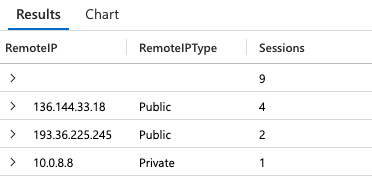
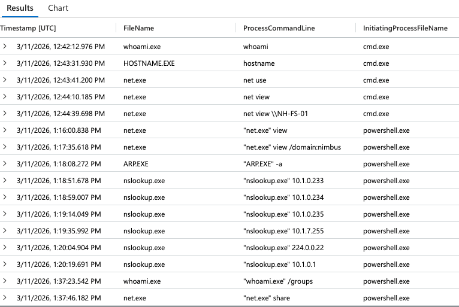
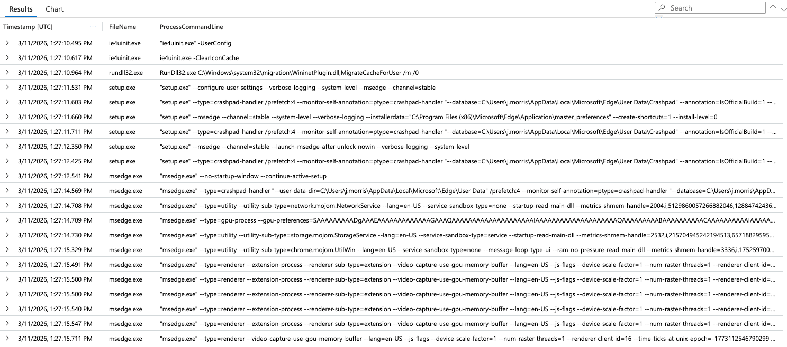
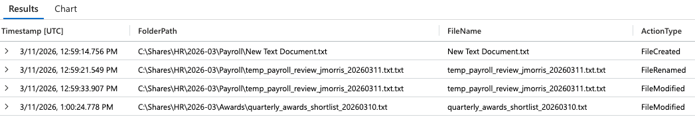

# Threat Hunt: Credential Compromise in a Healthcare Environment
Threat hunt reconstructing a credential-compromise attack from live enterprise telemetry — KQL, Microsoft Defender, MITRE ATT&amp;CK mapping. 
📄 **[Download the full case study (PDF)](Threat_Hunt_Case_Study.pdf)** — a 3-page executive summary of this investigation.

**A hands-on threat-hunting case study across live enterprise telemetry, using KQL and Microsoft Defender Advanced Hunting**

> This investigation was conducted in the Log(n) Pacific — a hands-on SOC training environment built on live, raw enterprise telemetry. *Nimbus Health is a fictional organization used for this exercise; the Log(n) Pacific environment and its telemetry are real.* The work demonstrates methodology, KQL proficiency, and analytical reasoning.

**Technology Used**
**Platform:** Microsoft Sentinel + Microsoft Defender for Endpoint (MDE) 
**Language:** KQL (Kusto Query Language)

**Analyst:** Latasha Seth
**Title:** Security Analyst
**Program:** Log(n) Pacific — SOC Build Project
**Date:** July 13, 2026

---

## Executive Summary

A billing analyst account at a healthcare clinic was flagged for unusual activity and referred for a "stale-access housekeeping" review. Telemetry told a different story. The account (`j.morris`) was not being used by an employee at the billing desk — it was being **driven remotely over RDP from external, public IP addresses**, using valid credentials. Once inside, the operator performed systematic reconnaissance, pivoted to the file server, **fabricated a fraudulent approved invoice, tampered with the billing audit trail, and systematically collected HR and payroll data belonging to other employees.**

The honest root cause was **not** an insider mistake and **not** malware. It was **credential compromise / account takeover by an external actor** — provable precisely because of what was *absent*: no dropped binaries, no exploitation, only native Windows tools and valid credentials throughout.

---

## Scenario & Scope

| | |
|---|---|
| **Organization** | Nimbus Health (fictional outpatient clinic; range environment is real) |
| **Estate** | Windows — billing, HR, IT, and file server hosts (`nh-*`) |
| **Telemetry** | Microsoft Sentinel + MDE tables: `DeviceLogonEvents`, `DeviceProcessEvents`, `DeviceFileEvents` |
| **Hunt window** | 08–18 March 2026 (broad filter; activity concentrated on 09–11 March) |
| **Host scope** | `DeviceName startswith "nh-"` |
| **The framing to challenge** | Paperwork called it "an insider who forgot to hand back access." The task: follow the logs, not the paperwork. |

Every query was bound to the window and host scope to stay clear of unrelated activity in the shared workspace:

```kql
| where Timestamp between (datetime(2026-03-08) .. datetime(2026-03-19))
| where DeviceName startswith "nh-"
```

---

## Methodology

A disciplined hunt loop rather than keyword-chasing:

- **Filter first** — scope every query to the window and hosts before anything else, so shared-workspace noise never leaks in.
- **Baseline, then hunt** — establish what *normal* looks like (machine accounts, scheduled tasks, app self-maintenance) so the *abnormal* announces itself. The parent process (`InitiatingProcessAccountName`) is the key "person vs. machine" tell.
- **Pivot across tables and hosts** — logon tells *who and from where*; process tells *what they ran*; file tells *what they touched*. The story only appears when they're joined — and impact lives where the sensitive data does.
- **Reason from absence** — a table expected to be busy coming back quiet is itself a finding.
- **Anchor in evidence** — state observable behavior as fact; keep inference clearly labeled.

---

## Key Findings

### Finding 1 — The account was driven from outside the building

The flagged billing account's successful sessions were **`RemoteInteractive` (RDP)** logons sourced from **external, public IP addresses** — not the interactive desk logons a real billing analyst produces. Windows itself labeled the sources `Public`.

```kql
DeviceLogonEvents
| where Timestamp between (datetime(2026-03-08) .. datetime(2026-03-19))
| where DeviceName startswith "nh-wks-bill-01"
| where AccountName == "j.morris"
| where ActionType == "LogonSuccess"
| where LogonType == "RemoteInteractive"
| summarize Sessions = count() by RemoteIP, RemoteIPType
| sort by Sessions desc
```



**Why it matters:** A billing analyst sitting at a desk does not generate remote sessions from public internet IPs. This is the first crack in the "insider" story — the account is being *driven from* somewhere it shouldn't be.

---

### Finding 2 — Noise ruled out, then the recon burst

Sorting the account's shell activity by time, the earliest hits were a burst of file **deletions** — a tempting but false lead. Reading the paths and parent process revealed the truth: **OneDrive updating itself**, deleting its own superseded version folders under AppData, launched by `explorer.exe` in sub-second bursts. Noise, not the intruder — the discipline to *rule this out* matters as much as finding real activity.

Past the noise, the operator ran a short, deliberate burst of native discovery commands — orienting, then naming a specific target: the file server.

```kql
DeviceProcessEvents
| where Timestamp between (datetime(2026-03-08) .. datetime(2026-03-19))
| where DeviceName startswith "nh-"
| where AccountName == "j.morris"
| where FileName in~ ("whoami.exe","hostname.exe","net.exe","net1.exe","nslookup.exe","arp.exe")
| project Timestamp, FileName, ProcessCommandLine, InitiatingProcessFileName
| sort by Timestamp asc
```

The sequence: `whoami` → `hostname` → `net use` → `net view` → **`net view \\NH-FS-01`** — general orientation collapsing onto one named system, the file server. A later, second burst widened the net with `net view /domain:nimbus` (domain enumeration) and an `nslookup`/`arp` sweep of the local subnet, immediately preceding a pivot.



**Why it matters:** This is classic post-access discovery (MITRE T1033, T1069, T1087, T1135). Recon wasn't aimless — it selected a target and mapped the path to it.

---

### Finding 3 — Lateral movement, and a red herring proven by absence

From the billing workstation, the account opened RDP sessions onto **two** more hosts: `nh-fs-01` (the file server) and `nh-wks-it-01` (the IT workstation). One was the real objective; one was a dead end.

Rather than assume, I proved it. Filtering the IT workstation's process activity and separating user-initiated from system-initiated processes showed that **everything on the IT box was automatic first-logon / RDP-session-setup activity** — `system`-launched profile setup, nothing the user ran.

```kql
DeviceProcessEvents
| where Timestamp between (datetime(2026-03-08) .. datetime(2026-03-19))
| where DeviceName has "nh-wks-it-01"
| where InitiatingProcessAccountName == "j.morris"
| where FileName !in~ ("userinit.exe","unregmp2.exe","taskhostw.exe","smartscreen.exe","explorer.exe","rdpclip.exe","tstheme.exe")
| project Timestamp, FileName, ProcessCommandLine
| sort by Timestamp asc
```



**Why it matters:** *Absence is a finding.* A landing is not activity. Proving the IT hop was empty confirmed the real impact was concentrated entirely on the file server — and demonstrates the rigor to distinguish a probe from an actioned host.

---

### Finding 4 — Impact: fraud, tampering, and out-of-role access on the file server

On `nh-fs-01`, the account acted far outside a submissions analyst's role. (Note: on the file server, `RequestAccountName` — not `InitiatingProcessAccountName` — carries the real actor for file events.)

- **Invoice fabrication** — the account reached the `Approved` sign-off folder (out of role) and *created a blank file, renamed it to impersonate a legitimate approved invoice, then wrote content into it* — planting a fraudulent, pre-approved-looking payable.
- **Audit-trail tampering** — modified `review_audit_20260311.txt`, the record meant to reflect the *reviewer's* actions, not a submitter's — altering the log that should have caught the misconduct.
- **Privilege & share discovery** — ran `whoami /groups` (checking what the stolen account could do) followed immediately by `net share` (enumerating what the server offered).

**Why it matters:** This is the payoff of the intrusion — financial fraud (fabricated invoice), anti-forensics (audit tampering, MITRE T1070), and abuse of an over-provisioned account that had write access it never should have had.

---

### Finding 5 — Systematic cross-department data collection

The final phase was data theft that reached beyond billing entirely, into HR and Payroll.

```kql
DeviceFileEvents
| where Timestamp between (datetime(2026-03-08) .. datetime(2026-03-19))
| where DeviceName has "nh-fs-01"
| where FolderPath has "HR"
| where InitiatingProcessAccountName == "j.morris" or RequestAccountName == "j.morris"
| project Timestamp, FolderPath, FileName, ActionType
| sort by Timestamp asc
```



The account opened another employee's payroll review (`payroll_review_dpatel_20260311.txt`) and, in the same burst, took a **non-payroll** HR file — `quarterly_awards_shortlist_20260310.txt` — which has no financial value. Payroll data was also staged inside billing folders under a disguised double-extension filename (`payroll_exception_reference_20260311.txt.txt`).

**Why it matters:** Two different HR data types taken in one burst characterizes this as **systematic collection of multiple HR data types, not a single opportunistic grab** (MITRE T1005). The awards file — useless for fraud — proves the collection was broad, not surgical. For breach scoping, exposure extends to *every* employee in *any* file the account touched, not just payroll.

---

## Attack Timeline

```
09 Mar 10:24  │ External actor authenticates via RDP from public IP (136.144.33.18)
              │ onto the billing workstation — valid credentials, no malware
              ▼
09 Mar 12:42  │ RECON — whoami → hostname → net use → net view → net view \\NH-FS-01
              │ (orientation collapses onto the file server as the target)
              ▼
11 Mar 13:17  │ WIDEN — net view /domain:nimbus (domain enumeration)
              │ + nslookup / arp sweep of the local subnet (host discovery)
              ▼
11 Mar 13:27  │ PIVOT — RDP to nh-wks-it-01 (IT box)  →  RED HERRING (no activity)
11 Mar 13:36  │ PIVOT — RDP to nh-fs-01 (file server)  →  the real objective
              ▼
11 Mar 12:11  │ IMPACT — fabricate fake approved invoice; tamper with audit trail;
              │ whoami /groups → net share (privilege & share discovery)
              ▼
11 Mar ~13:40 │ COLLECTION — open dpatel's payroll; take awards shortlist;
              │ stage payroll data in billing folders (disguised .txt.txt)
              ▼
   ROOT CAUSE │ Credential compromise / account takeover by an external actor.
              │ No malware. No exploitation. Valid credentials throughout.
```

*(Times reflect distinct activity bursts observed across the window; some administrative and collection actions on 11 March overlap.)*

---

## MITRE ATT&CK Mapping

| Tactic | Technique | ID | Evidence in this hunt |
|---|---|---|---|
| Initial Access / Persistence | Valid Accounts | **T1078** | External actor using valid credentials of a normal account |
| Lateral Movement | Remote Services: RDP | **T1021.001** | `RemoteInteractive` logons; pivots to IT box and file server |
| Discovery | System Owner/User Discovery | **T1033** | `whoami`, `whoami /groups` |
| Discovery | Permission Groups Discovery | **T1069** | `whoami /groups` |
| Discovery | Account Discovery | **T1087** | `net user`, `net view /domain:nimbus` |
| Discovery | Network Share Discovery | **T1135** | `net share`, `net view \\NH-FS-01` |
| Discovery | Remote System Discovery | **T1018** | `nslookup` / `arp` subnet sweep |
| Collection | Data from Local System | **T1005** | Payroll + awards files collected in one burst |
| Defense Evasion | Indicator Removal | **T1070** | Modification of the billing audit trail |

---

## Skills Demonstrated

- **KQL / Microsoft Defender Advanced Hunting** — multi-table queries across `DeviceLogonEvents`, `DeviceProcessEvents`, `DeviceFileEvents`; summarization, time-binning, string operators, and account-field pivoting.
- **Hunt methodology** — filter-first scoping, baseline establishment, noise reduction, cross-table and cross-host pivoting.
- **Analytical rigor** — proving a negative ("absence is a finding"), separating observable fact from inference, and challenging a pre-supplied narrative with evidence.
- **Windows internals** — machine vs. user accounts, logon types, well-known SIDs, RDP session artifacts, living-off-the-land tooling, and how the same telemetry logs differently across endpoint vs. server.
- **MITRE ATT&CK** — mapping observed behavior to techniques across the kill chain.
- **Incident reasoning** — reconstructing an intrusion end-to-end and articulating an evidence-based root cause.

---

## Root Cause — The Honest Read

The clinic wanted this written up as a curious employee with leftover access. The evidence rules that out:

- **Not an insider** — the account was driven from **external, public IPs** over RDP. An employee with leftover access logs in *internally, from their own desk*.
- **Not malware** — **no dropped binaries** anywhere; only native Windows tools (living off the land).
- **Not exploitation** — **valid credentials throughout**; no privilege-escalation exploit, no vulnerability abuse.

**Root cause: credential compromise / account takeover by an external actor using the valid credentials of a normal account, driven in over RDP from external sources.** The absence of malware and exploitation is precisely what proves it.

---

## Notes on Control Gaps (Preview)

The intrusion succeeded because of identifiable control failures — the basis for a companion GRC analysis:

- **Least privilege (AC-6)** — a submissions account had write access to the `Approved` sign-off folder and reach into HR/Payroll shares.
- **Separation of duties (AC-5)** — no barrier between "submit" and "approve" stages of the billing workflow.
- **Audit-log integrity (AU-9)** — the audit trail was modifiable by a non-reviewer.
- **Remote access & boundary protection (AC-17, SC-7)** — external RDP reached internal workstations.
- **Identity & monitoring (IA-2, SI-4)** — valid-credential misuse from an external source generated no alert; MFA would have broken the takeover.

📄 **[Download this case study as a PDF](Threat_Hunt_Case_Study.pdf)** — print-friendly version for offline reading or attaching to applications.

*The companion control-gap analysis and target-state access matrix is in development and will be linked here.*


